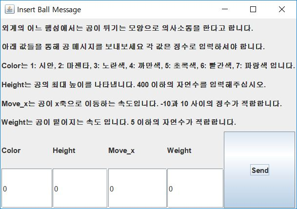
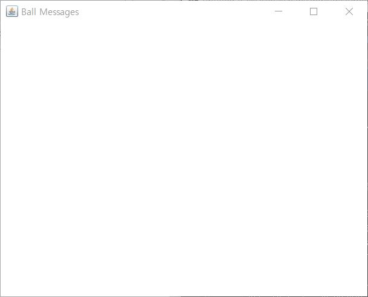
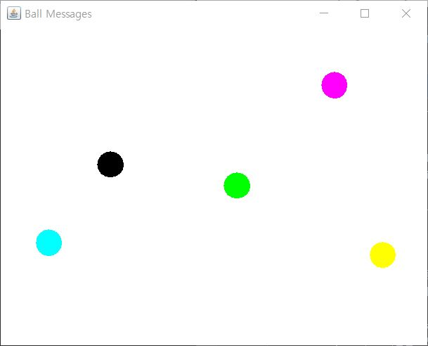

### 이 프로그램은 ball이라는 형태로 메시지를 주고 받는 Ball messenger입니다.

Ball messenger를 사용하시려면 먼저 아래 파일을 다운로드 해주세요.
> ### [Socket server for BallTalk](./ballTalkServer.jar)
이 파일은 Ball, Server, ClientHandler 세개의 자바 클래스 파일을 가지고 있는 Java Archive 파일입니다.
Ball 파일은 메시지의 형태인 Ball의 정보와, 작동방식을 규정하고 있습니다.
Server와 ClientHandler는 각각 이용자와의 연결, 각 이용자에 대한 정보 관리를 다루는 파일입니다.

jar 파일을 다운로드 하셨으면 Ball.java, ClientMain.java, Sender.java, Receiver.java를 당신의 컴퓨터에 복사해주세요.
Ball 파일은 위 설명과 같습니다.
ClientMain은 서버와의 통신을 담당합니다.
Sender와 Receiver는 각각 메시지를 보내고 받는 정보를 표시하는 GUI입니다.

이제 당신의 PC 혹은 서버에서 jar 파일을 실행시켜주세요.(java -jar ballTalkServer.jar)
ClientMain.java의 30라인을 보시면 다음과 같이 쓰여있습니다.
Socket s = new Socket("54.210.11.118", 4242)
"54.210.11.118" 이 부분을 당신이 jar 파일을 실행한 PC 혹은 서버의 IP로 변경해주세요.
이제 ClientMain을 실행하시면 다음과 같은 화면이 나타납니다.

이 화면의 GUI를 통해 메세지를 보낼 수 있습니다.

주고 받은 메시지가 표시되는 화면입니다. 메시지가 없는 초기화면은 이렇게 하얗게 보입니다.
프로그램을 실행시켰을 때 메시지 표시화면이 입력 화면을 가리고 있을 수 있습니다.
창을 옆으로 옮겨서 샤옹하시면 됩니다.

이제 Ball messenger로 메시지를 주고받아보세요.
